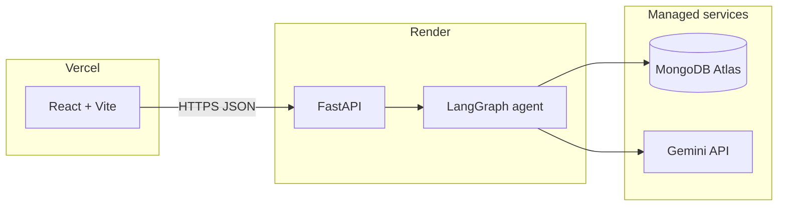

# FreightCheck

**Planner-driven logistics document auditing.** Upload a Bill of Lading, commercial invoice, and packing list (PDFs). A LangGraph agent extracts structured fields with Gemini, plans validations, runs tools (numeric match, semantic checks, container rules), and compiles an exception report—while persisting **every planner decision and tool call** so you can replay the reasoning.

---

## Live demo

Replace the placeholders after you deploy (default subdomains are fine until you attach custom domains):

| Surface | URL |
|--------|-----|
| **Frontend** (Vercel) | `https://YOUR-APP.vercel.app` |
| **Backend API** (Render) | `https://YOUR-API.onrender.com` |
| **Health** | `GET https://YOUR-API.onrender.com/health` |

**CORS:** the backend only accepts origins listed in `ALLOWED_ORIGINS`. Set that on Render to your exact Vercel URL (no trailing slash). On Vercel, set **`VITE_API_URL`** to your Render base URL (same name as in [`frontend/.env.example`](frontend/.env.example) and [`frontend/src/api/client.ts`](frontend/src/api/client.ts)—not `VITE_API_BASE_URL`).

---

## Architecture



1. **Upload** — `POST /upload` parses PDFs to text, caches by `session_id` (short TTL).
2. **Audit** — `POST /audit` creates a Mongo session, runs the graph in a **background task**, returns **201** immediately.
3. **Polling** — the UI polls `GET /sessions/:id/trajectory` (live tool/planner stream) then `GET /sessions/:id` for the full report when status is terminal.

Full contracts live in [`knowledge/`](knowledge/) (API, data models, LangGraph flow, frontend spec).

---

## Example: Incoterm and cross-document checks

A common discrepancy is **Incoterm mismatch** (e.g. BoL shows **CIF** while the invoice states **FOB**). The planner may call `validate_field_match` on `incoterm`, then `flag_exception` with structured evidence. Numeric paths compare weights and totals with tolerances; container tools enforce ISO-style checks.

**Trajectory (conceptual)** — what you see in the session UI is backed by persisted `planner_decisions` and `tool_calls` on the session document:

```text
plan_validations → validate_field_match(doc_a=bol, doc_b=invoice, field=incoterm)
                 → flag_exception(severity=critical, field=incoterm, evidence={ val_a, val_b })
                 → compile_report
```

The UI orders these events by execution time so a non-technical reviewer can follow the agent’s chain without reading code.

---

## Trajectory view (screenshot placeholder)

After your first successful production audit, capture the trajectory panel (Issue PDFs or your own fixtures) and replace this asset:


Suggested filename for the real asset: `docs/images/trajectory-demo.png` or `.gif` (15s loop is enough for a portfolio README).

---

## Local development

**Backend** ([`backend/`](backend/)) — Python 3.11+, [`uv`](https://docs.astral.sh/uv/):

```bash
cd backend
cp .env.example .env   # add GEMINI_API_KEY, MONGODB_URI
uv sync --extra dev
uv run uvicorn freightcheck.main:app --reload --host 127.0.0.1 --port 8000
```

- API root: `http://127.0.0.1:8000/` (JSON index), **`/docs`** OpenAPI, **`/health`** Mongo + Gemini flags.

**Frontend** ([`frontend/`](frontend/)) — Node 20+:

```bash
cd frontend
cp .env.example .env    # VITE_API_URL=http://127.0.0.1:8000
npm ci
npm run dev
```

**Tests** — from `backend/`: `uv run pytest tests -m "not integration"` (CI parity). Full setup and Atlas/Gemini steps: [`knowledge/freightcheck_environment_setup.md`](knowledge/freightcheck_environment_setup.md).

---

## Deployment (Milestone 8)

**Secrets never go in git.** Use Render and Vercel dashboards for production values.

### Render (backend)

1. New **Blueprint** (or Web Service) from this repo; Render reads [`render.yaml`](render.yaml) at the repo root.
2. The service uses `rootDir: **backend**` so builds run where `pyproject.toml` and `uv.lock` live.
3. In **Environment**, set (minimum):
   - `MONGODB_URI` — Atlas connection string including DB name and `retryWrites` / `w` as in `.env.example`.
   - `GEMINI_API_KEY` — from Google AI Studio.
   - `ALLOWED_ORIGINS` — your Vercel URL only, e.g. `https://your-app.vercel.app` (comma-separated if you add preview URLs).
4. Deploy, then verify: `curl -sS https://YOUR-API.onrender.com/health` → `"status":"ok"`, `"mongo":"connected"`, `"gemini":"configured"`.

### Vercel (frontend)

1. Import the repo; set **Root Directory** to `frontend`.
2. **Environment variable:** `VITE_API_URL` = `https://YOUR-API.onrender.com` (no trailing slash).
3. Deploy and open the Vercel URL; complete **upload → audit → trajectory → report** once.

### Post-deploy checklist

- [ ] `/health` on production shows Mongo connected and Gemini configured.
- [ ] Browser network tab: no CORS errors from your Vercel origin.
- [ ] Full audit completes; session reaches `complete`, `failed`, or `awaiting_review` with plausible data.
- [ ] Scan Render/Vercel logs for accidental secret leakage (API key substrings, full Mongo URI with password).

---

## Repository layout

| Path | Role |
|------|------|
| [`backend/`](backend/) | FastAPI app, agent, eval harness |
| [`frontend/`](frontend/) | React UI; [`vercel.json`](frontend/vercel.json) SPA rewrites |
| [`render.yaml`](render.yaml) | Render Blueprint for the API |
| [`knowledge/`](knowledge/) | PRD, API contract, specs |

---

## License / status

Portfolio / MVP quality. See [`knowledge/freightcheck_prd.md`](knowledge/freightcheck_prd.md) for scope and non-goals.
